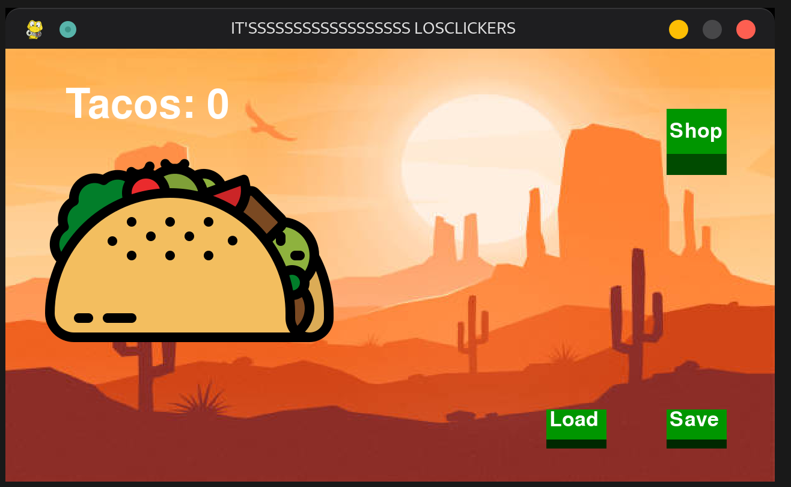

# losClickers
ZC's CSAI101 semester project

The premise of this project is to make a basic clicker game inspired by [cookie clicker]("https://orteil.dashnet.org/cookieclicker") 

The game's goal is to reach the highest number of tacos possible. You can achieve this by clicking on the taco, buying upgrades to increase tacos per click, and buying buildings such as the Taco Machine to passively generate tacos.

You can buy upgrades from the shop to increase your Tacos exponentially faster. 

You can also save your progress and load it at any time you want. 